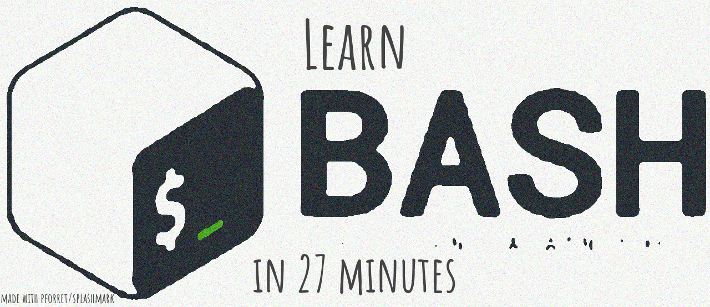

# Learn Bash in 10 minutes
Learn Bash scripting in 10 minutes


This is inspired by 
[Learn Go in ~5mins](https://gist.github.com/prologic/5f6afe9c1b98016ca278f4d507e65510),
[A half-hour to learn Rust](https://fasterthanli.me/articles/a-half-hour-to-learn-rust)
and [Zig in 30 minutes](https://gist.github.com/ityonemo/769532c2017ed9143f3571e5ac104e50).

## Why bash scripting?
`bash` (Bourne Again Shell) was developed in 1989, which makes it younger than C 
but probably older than anything you're used to developing in.
This does not make it old-fashioned or obsolete. 
Bash runs practically everywhere: on **Unix/Linux**, on **MacOS** and **Windows** (WSL),
it is used in all kinds of 'modern' software (Docker, deployment/build scripts, CI/CD) 
and the chances that you will have a rich developer career
without ever using `bash` are quasi zero. So why not get good at it?

## Your first script

Whenever you are typing in your Terminal/Console, you are in an interactive `bash` shell 
(or its more sophisticated cousins `zsh` or `fish`). 
Any command you can type here, like `ls`, `whoami`, `echo "hello"` qualifies as a bash command, 
and can be used in a script.

While in your terminal, enter the following commands:
```bash
touch myscript.sh       # create the file 'myscript.sh' as an empty file
```

Go edit this new file with your favorite text editor (Sublime/Vcode/JetBrains/...) and add the following 2 lines:

```bash
#!/usr/bin/env bash
echo "Hello world!"
```

Now go back to your Terminal and type
```bash
> chmod +x myscript.sh    # make the file executable, so you can call it directly as ./myscript.sh
> ./myscript.sh         # execute your new script
Hello world!
```

## Variables

Bash variables are untyped.
The value and/or context of a variable determines if it will be interpreted as an integer, a string or an array.

```bash
width=800               # variables are assigned with '='
name="James Bond"       # strings with spaces should be delimted by " or '
user_name1=jbond        # variable names can contains letters, digits and the characters . - _

echo "Welcome $name!"   # variable are referenced with a $ prefix
file="${user}_${uniq}"  # ${var} can be used to clearly delimit the name of the variable
echo "${width:-400}"    # if variable $width is not set, the default 400 will be used
```

## Functions

## Arrays

## Maps

## Files and fil descriptors

## Flow control structures

## Error handling

## Creating and import packages

## Now you're a Gopher!


For more details, check the latest [documentation](https://golang.org/doc/),
or for a less half-baked tutorial, please read the official
[Go Tutorial](https://golang.org/doc/tutorial/getting-started) and [A Tour of Go](https://tour.golang.org/welcome/1).

Other great tutorials you can read:

- [Learn X in Y minutes](https://learnxinyminutes.com/docs/go/) (_Where X=Go_)